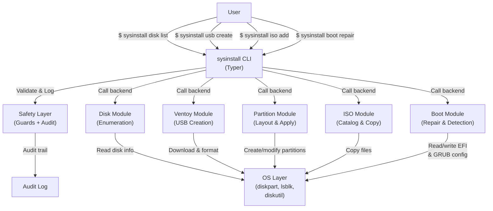
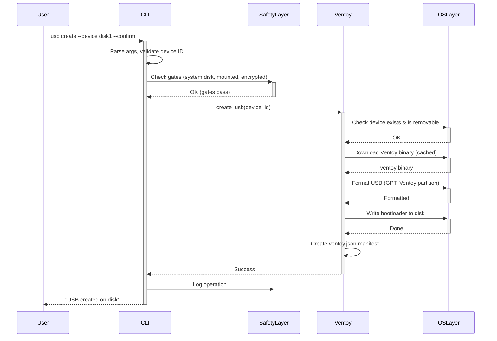
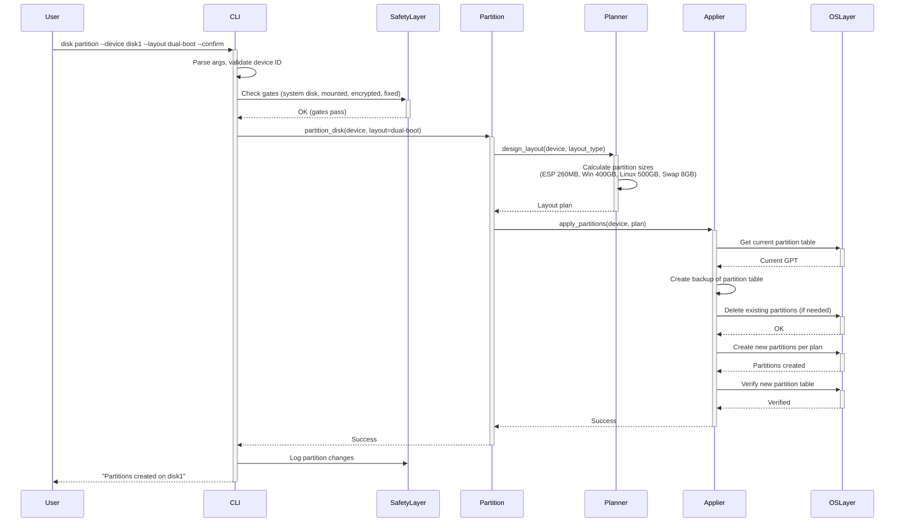
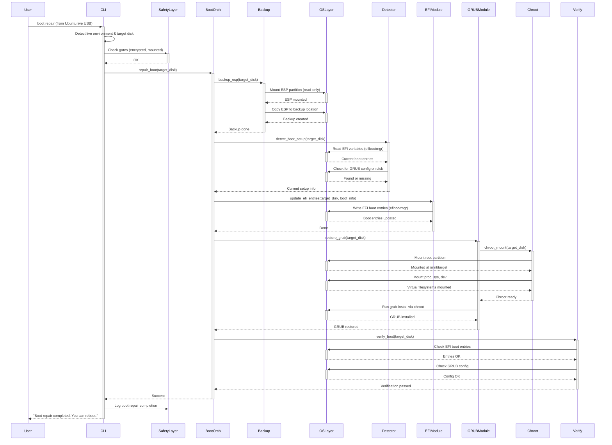
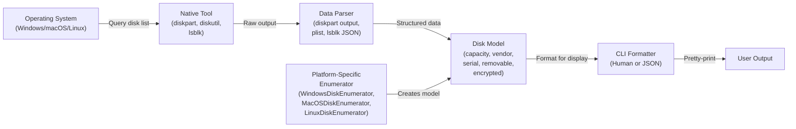
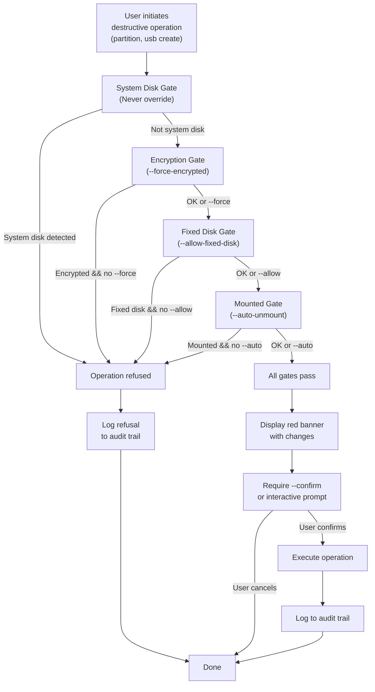
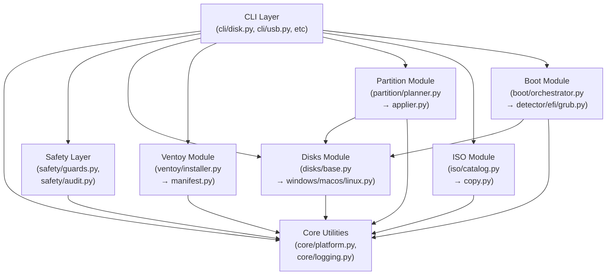
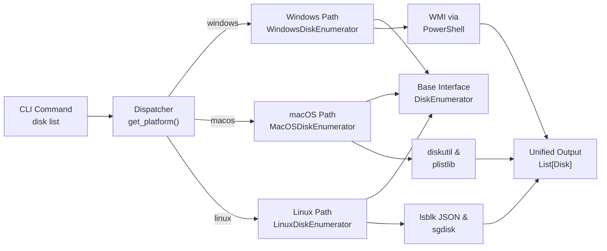
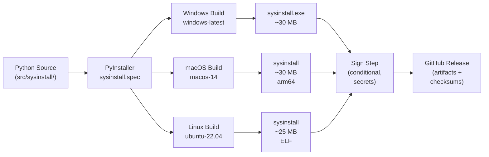
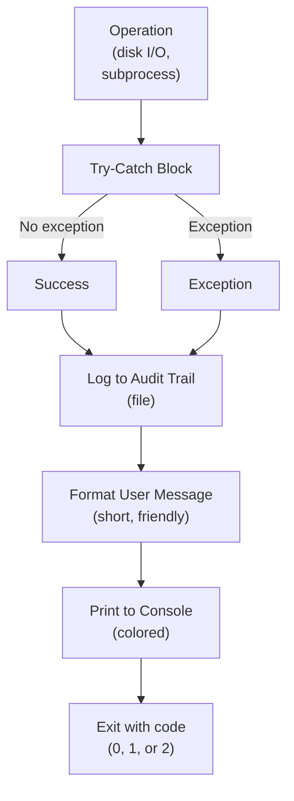

# System Architecture

## C4 Container Diagram
High-level view of system components and their interactions.

## Module Interaction: USB Creation Sequence
Detailed sequence diagram for `sysinstall usb create --device <id> --confirm`.

## Module Interaction: Disk Partitioning Sequence
Detailed sequence diagram for `sysinstall disk partition --device <id> --layout dual-boot --confirm`.

## Module Interaction: Boot Repair Sequence
Detailed sequence diagram for `sysinstall boot repair` (run from Ubuntu live USB).

## Data Flow: Disk Enumeration
How disk information flows from OS layer to CLI output.

## Safety Gate Evaluation Flow
How safety gates are evaluated before destructive operations.

## File Organization & Dependency Graph
Module dependencies and import structure.

## Platform Abstraction Pattern
Example: How disk enumeration works across platforms.

## Binary Build & Packaging
How source code becomes platform-specific executables.

## Error Handling & Recovery
How errors are handled and logged.

## Limitations & Gaps (Documented)
- **macOS USB creation:** Ventoy upstream doesn't support macOS; documented workaround (pre-built image + `dd`)
- **Persistence files:** Ventoy `.dat` files deferred to v2 (YAGNI)
- **BIOS-mode dual-boot:** UEFI only in MVP
- **BitLocker recovery:** Warn only (no PCR sequencing)
- **Universal2 macOS binary:** arm64 only (Intel dropped per decision #3 & #10)

All limitations are documented in troubleshooting guides and relevant install docs.
